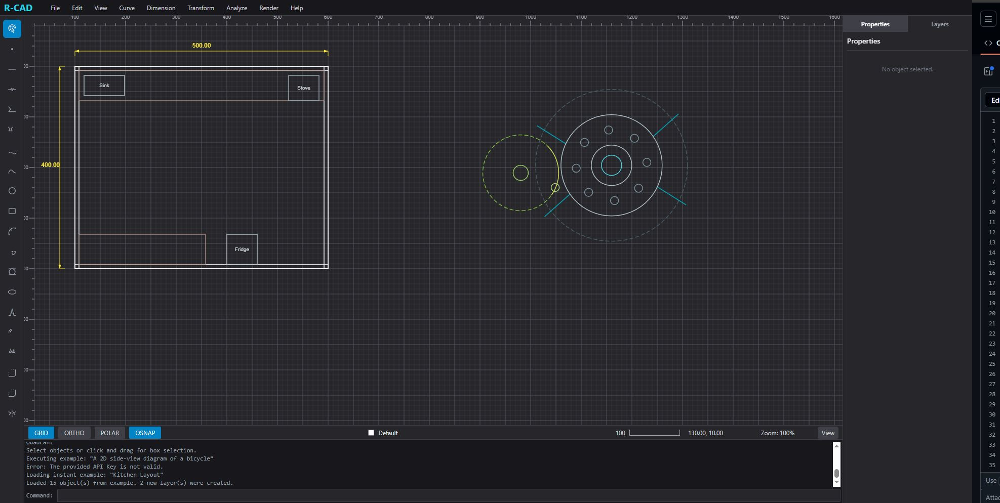

# ReactCad2d: Sistema CAD Profesional Web

**ReactCad2d** es una plataforma de diseño asistido por computadora (CAD) en 2D desarrollada con React. Ofrece un entorno profesional completo para dibujo técnico, combinando herramientas de precisión matemática con la flexibilidad de la inteligencia artificial.
[2D RCAD ](https://xocostudio.github.io/ReactCad2d-Sistema-CAD-Profesional-Web/)  
---

## 🛠️ Funcionalidades Principales

### 1. Dibujo de Precisión (Geometría Base)
*   **Entidades Soportadas:** Líneas, Polilíneas, Círculos, Arcos, Elipses, Splines (NURBS), Rectángulos y Puntos.
*   **Anotaciones:** Herramienta de texto con soporte para múltiples fuentes, alineaciones y rotación.
*   **Tipos de Línea:** Sólida, Discontinua (Dashed), Punteada (Dotted) y Punto-Raya (DashDot).

### 2. Acotación Inteligente (Dimensions)
*   **Lineales y Alineadas:** Mide distancias horizontales, verticales o siguiendo la inclinación de los objetos.
*   **Radiales y de Diámetro:** Acotación automática de círculos y arcos.
*   **Angulares:** Mide ángulos entre dos segmentos de forma intuitiva.
*   **Coordenadas:** Etiquetado de puntos específicos en el plano (X e Y).

### 3. Sistema de Referencia a Objetos (OSNAP)
Asegura la precisión absoluta con el motor de snapping avanzado:
*   **Extremo (Endpoint) / Punto Medio (Midpoint).**
*   **Centro / Centro Geométrico.**
*   **Intersección / Perpendicular / Tangente.**
*   **Cuadrante / Nodo / Punto Cercano.**

### 4. Línea de Comandos y Atajos
*   **Entrada Directa:** Usa la línea de comandos para introducir coordenadas (`100,200`), distancias de desfase (Offset) o ejecutar herramientas por nombre.
*   **Flujo de Trabajo Dinámico:** Comandos como `OFFSET`, `FILLET`, `CHAMFER` y `EXPLODE` disponibles directamente.

### 5. Asistente de IA (Gemini Integration)
*   **Dibujo Natural:** Describe lo que quieres dibujar (ej: "Dibuja un engranaje con 12 dientes" o "Crea un plano de una habitación de 4x5 metros") y la IA generará la geometría técnica automáticamente.
*   **Generación de Capas:** La IA puede organizar automáticamente los objetos en capas lógicas con colores diferenciados.

### 6. Gestión de Capas y Organización
*   **Panel de Capas:** Control total sobre el color, visibilidad y bloqueo de capas.
*   **Agrupación:** Agrupa objetos para manipularlos como una sola entidad o utiliza `EXPLODE` para descomponer polilíneas y formas complejas en segmentos básicos.

---

## ⌨️ Comandos y Atajos Populares

| Comando | Acción |
| :--- | :--- |
| **`LINE`** | Inicia el dibujo de un segmento. |
| **`CIRCLE`** | Inicia el dibujo de un círculo. |
| **`OFFSET`** | Crea un objeto paralelo a una distancia dada. |
| **`UNDO / REDO`** | `Ctrl + Z` / `Ctrl + Y`. |
| **`ESC`** | Cancela la herramienta activa o limpia la selección. |
| **Espacio** | Repite el último comando ejecutado. |
| **Coords** | Escribe `x,y` para posicionar puntos con precisión. |

---

Diseñado para ingenieros, arquitectos y entusiastas del diseño técnico. **ReactCad2d** traslada la potencia del CAD tradicional al navegador moderno. 📐✨
